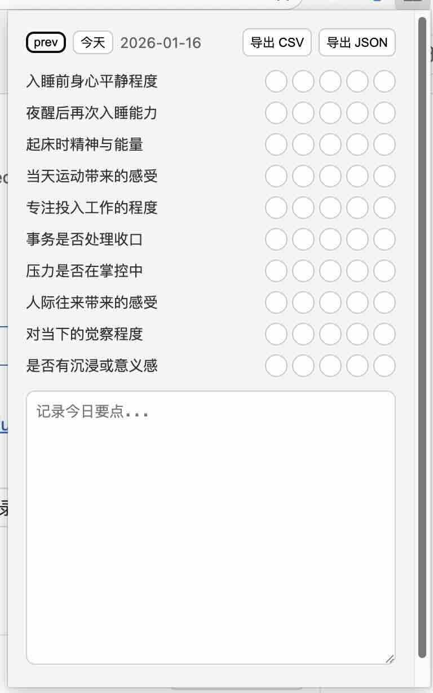

# Daily State Tracker（本地浏览器扩展）

本扩展为本地优先、无后端的 MV3 浏览器扩展（Chrome/Edge 兼容），用于记录每日状态。弹窗内提供 10 个固定维度的 1–5 星评分与备忘录，自动保存；支持 CSV 导出与 JSON 备份导出。

## 功能
- 10 个固定维度评分（1–5 星）
- 备忘录（自动保存）
- CSV 导出
- JSON 备份导出
- 日期浏览：可查看前一天记录；非今日只读

## 安装（Chrome/Edge）
1. 打开扩展管理页：
   - Chrome: `chrome://extensions/`
   - Edge: `edge://extensions/`
2. 打开“开发者模式”。
3. 点击“加载已解压的扩展”，选择本项目目录。

## 使用
- 评分：点击星级立即保存。
- 备忘录：输入后自动保存（轻微防抖）。
- 日期：
  - 点击 `prev` 查看前一天记录。
  - 点击 `今天` 返回当天记录（若已是当天则无动作）。
  - 非当天记录为只读，无法修改。
- 导出：
  - `导出 CSV`：导出所有日期记录为 CSV。
  - `导出 JSON`：导出完整备份数据为 JSON。

## 字段（中文说明 + 英文列名）
| 中文维度 | 英文列名 | 中文说明 |
| --- | --- | --- |
| 睡前平静度 | `pre_sleep_calmness` | 入睡前身心平静程度 |
| 重新入睡能力 | `sleep_recovery` | 夜醒后再次入睡能力 |
| 起床时状态 | `wake_up_state` | 起床时精神与能量 |
| 运动质量 | `exercise_quality` | 当天运动带来的感受 |
| 深度工作 | `deep_work` | 专注投入工作的程度 |
| 事务清偿感 | `task_closure` | 事务是否处理收口 |
| 压力可控度 | `stress_manageability` | 压力是否在掌控中 |
| 人际互动质量 | `social_interaction` | 人际往来带来的感受 |
| 在场感 | `presence` | 对当下的觉察程度 |
| 深度体验 | `deep_experience` | 是否有沉浸或意义感 |

## 数据与存储
- 数据存储于 `chrome.storage.local`。
- 记录以本地日期 `YYYY-MM-DD` 为键。
- 导出 CSV 文件名：`daily_state_tracker_export.csv`
- 导出 JSON 文件名：`daily_state_tracker_backup.json`

## 开发结构
- `manifest.json`：扩展清单
- `popup.html`：弹窗 UI
- `popup.js`：弹窗逻辑
- `styles.css`：样式
- `storage.js`：存储封装
- `csv.js`：CSV 导出
- `backup.js`：JSON 备份导出
